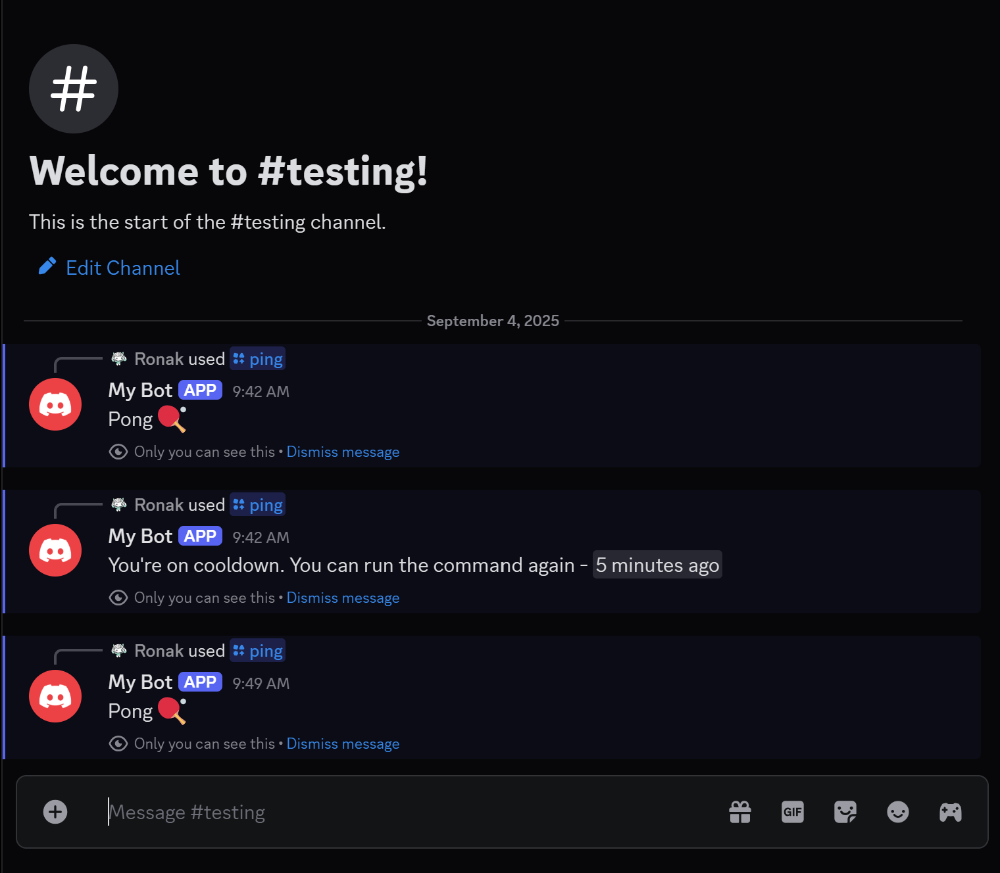
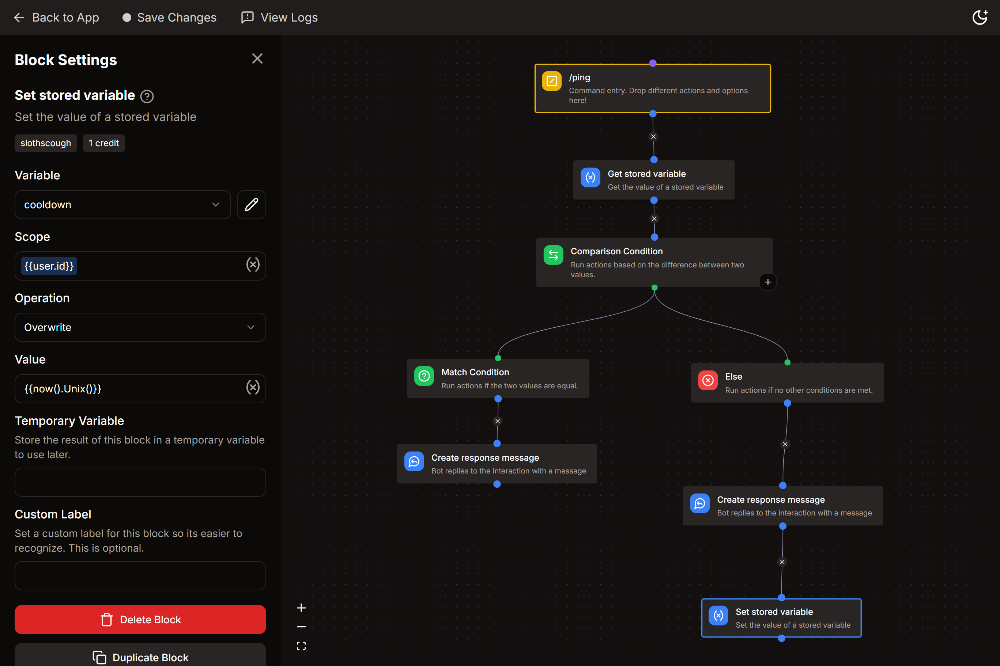

# Command Cooldowns

Add cooldowns to your commands or event listeners to prevent spam and have more control over your commands.



## 📝 - Step 1

- Create a variable named \"cooldown\" from your [Kite](https://kite.onl/) dashboard - **Stored Variables** tab.
- Set the variable as scoped.

:::info
### Usage of scopes ⚙️
 
- **`user.id` - for user-specific cooldowns**
   - _if `x` user invokes the command, it won't affect `y` user._
- **`guild.id` - for server-wide cooldowns**
   - _if `x` user invokes the command, **all the users** in the server will be on cooldown for using the command._
- **`0` - for global cooldown**
   - _if `x` user invokes the command in any server, all the users across all the server the bot is present in would be on cooldown for using the command._

:::

## 📝 - Step 2

- Add these blocks before your actual command flow/actions :
  - **Get Stored Variable**
  - **Comparison Condition**

**Get Stored Variable**
- **Variable** : `cooldown`
- **Scope** : `{{user.id}}` / `{{guild.id}}` / `0` [ see above for correct usage ]

**Comparison Condition**
- **Base Value :**
```go
{{now().Unix() - (result('GET_VARIABLE') ?? 0)}}
```
:::note
Replace 'GET_VARIABLE' with your actual block's name.
:::

- **Match Condition**
  - **Comparison Mode** - `LESS THAN`
  - **Comparison Value :**
```go
{{duration("2m").Seconds()}}
```
:::note
Replace "2m" with your desired duration. (see below)
:::

::::info
### 📌 Correct Usage for `duration`

- Valid time units are \"s\", \"m\", \"h\".  
_for eg._
  - if you want 2 hour cooldown - `{{duration("2h").Seconds()}}`
  - 2 hour 30 mins - `{{duration("2h30m").Seconds()}}`
  - 2 hour 30 mins 5 seconds - `{{duration("2h30m5s").Seconds()}}`
  - 20 m 10 s - `{{duration("20m10s").Seconds()}}`

:::warning
Days tag - **\"d\" is not accepted**  
- If you want `x days` cooldown, you'll have to convert it to hours.
  - _for eg._ : 4 days = **96h** , 2d 3h = **51h** , etc.

:::
::::

## 📝 - Step 3

- **_if the condition is true_** :
  - _You're on cooldown. You can run the command again - `<t:{{result('GET_VARIABLE') + duration("2m").Seconds()}}:R>`_
- **else** :
  - _connect your original command flow_

## 📝 - Step 4
At the end of your actual command flow, add the **Set Stored Variable** block
- **Variable** : `cooldown`
- **Scope** : `{{user.id}}` / `{{guild.id}}` / `0`  [ see above for correct usage ]
- **Operation** - `overwrite`
- **Value** - `{{now().Unix()}}`



:::tip
*If you have multiple commands where you want to have a separate cooldown for each command, you can create command-wise scopes.*

Just add your command name before the actual scope. *for eg.,*  
I've 2 commands `/echo` & `/ping` and I want to add user cooldown to both. In this case I'll use the following scopes:  
   - `echo-{{user.id}}`
   - `ping-{{user.id}}`

:::
