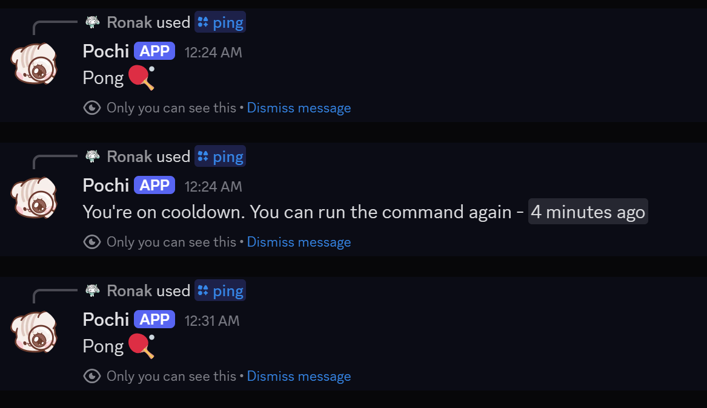

# Command Cooldowns

Add cooldowns to your commands or event listeners to prevent spam and have more control over your commands.



## 📝 - Step 1

- Create a variable named \"cooldown\" from your [Kite](https://kite.onl/) dashboard \u003e **Stored Variables** tab.
- Set the variable as scoped.

### Usage of scopes ⚙️

- **`user.id` - for user-specific cooldowns**
- _if `x` user invokes the command, it won't affect `y` user._
- **`guild.id` - for server-wide cooldowns** - _if `x` user invokes the command, **all the users** in the server will be on cooldown for using the command._
- **`0` - for global command**
- _if `x` user invokes the command in any server, all the users across all the server the bot is present in would be on cooldown for using the command._

## 📝 - Step 2

- Add these blocks before your actual command flow/actions :
- **Get Stored Variable**
- **Comparison Condition**

### **Get Stored Variable**

- **Variable** : `cooldown`
- **Scope** : `{{user.id}}` / `{{guild.id}}` / `0` [ see above for correct usage ]

### **Comparison Condition**

- **Base Value :**

```go
{{now().Unix() - (result('GET_VARIABLE') ?? 0)}}
```

````go

- **Match Condition**
- **Comparison Mode** - `LESS THAN`
- **Comparison Value :**
  ```go
{{duration("2m").Seconds()}}
````

### 📌 Correct Usage for `duration` :

- Valid time units are \"s\", \"m\", \"h\".
- _for eg._
- if you want 2 hour cooldown - `{{duration(\"2h\").Seconds()}}`
- 2 hour 30 mins - `{{duration(\"2h30m\").Seconds()}}`
- 2 hour 30 mins 5 seconds - `{{duration(\"2h30m5s\").Seconds()}}`
- 20 m 10 s - `{{duration(\"20m10s\").Seconds()}}`

- Days tag - **\"d\" is not accepted**
- If you want `x days` cooldown, you'll have to convert it to hours.
- _for eg._ : 4 days = **96h** , 2d 3h = **51h** , etc.

## 📝 - Step 3

- **_if the condition is true_** :
- _You're on cooldown. You can run the command again - `\u003ct:{{result('GET_VARIABLE') + duration(\"2m\").Seconds()}}:R\u003e`_
- **else** :
- _connect your original command flow_


