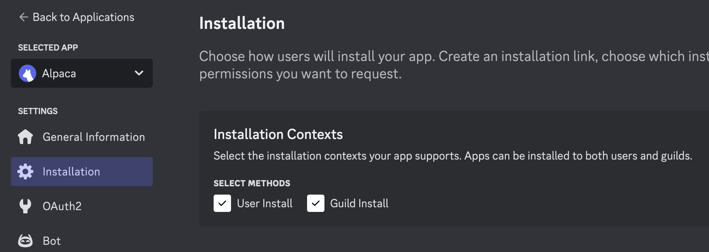
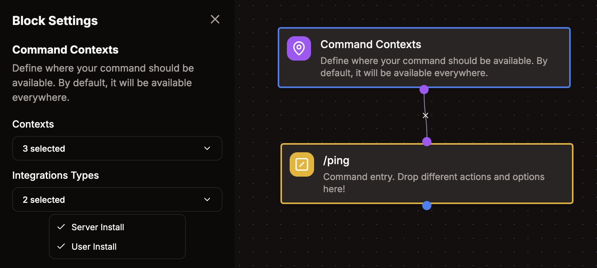

# User Installable Apps

Discord apps are typically installed by server administrators and only work within their specific servers. However, Discord also supports user-installable apps that work across all servers a user has access to. While these apps have some limitations compared to server-installed apps, they're perfect for personal utility tools that you want to use anywhere.

Kite makes it easy to create user-installable Discord apps without writing any code. This guide will walk you through creating and configuring a user-installable app with Kite.

:::note
Some Discord servers may restrict the usage of user-installable apps for moderation purposes. If your app isn't working in a particular server, check that server's settings.
:::

## Creating Your App

To create your Discord app, follow the steps in the [getting started guide](/guides/getting-started).

## Configuring Installation Settings

After creating your app, you'll need to configure how it can be installed. Open your app in the [Discord Developer Portal](https://discord.com/developers/applications) and navigate to the `Installation` section in the left sidebar.

Under `Installation Contexts`, enable the `User Install` checkbox and save your changes. If you want your app to be exclusively user-installable, you can optionally disable the `Guild Install` option.

## Installing the App

You can now add the app to your Discord account by clicking `Invite app` in the top-right corner of the Kite dashboard. You'll have the option to install the app either to your personal account or to a specific server. For this guide, we'll install it to your account.

Once installed, you can use the app's commands in any server you're a member of, as well as in direct messages with the bot or other users.

## Managing Command Availability

By default, all commands created in Kite work regardless of how the app was installed (user or server installation). However, you can customize this using the `Command Contexts` option node in the Kite Flow editor.

This node allows you to:

- Restrict commands to only work with server installations
- Restrict commands to only work with user installations
- Specify whether commands work in DMs, servers, or both

