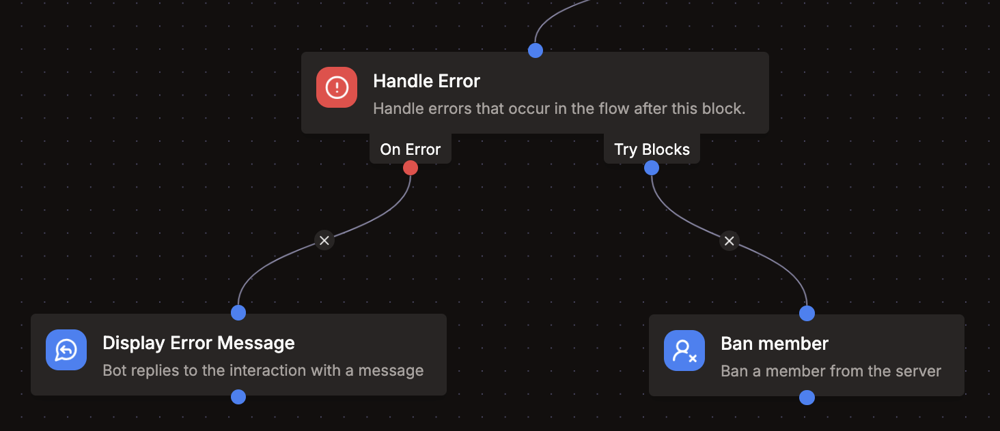

import EmbedFlowNode from "../../../../src/components/EmbedFlowNode";

# Channel Condition

<EmbedFlowNode type="control_error_handler" />

The `Error Handler` block allows you to run custom logic when an error occurs in the blocks that are children of this block.

The error message is available as the result of this block. You can use this to display a message to the user or do anything else you want with the error.

This is useful if you don't want the default error handling to be used. If you still want errors to be logged, you can use the `Log Message` block.

