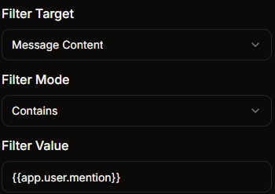
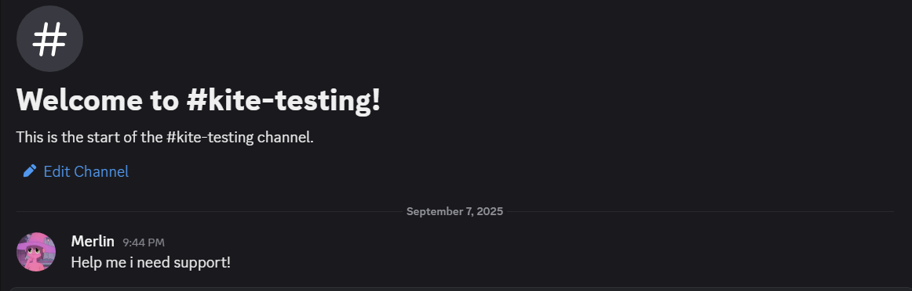
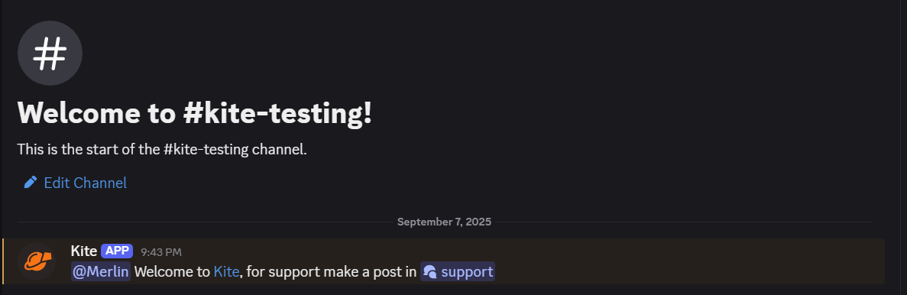

import EmbedFlowNode from "../../../../src/components/EmbedFlowNode";
import NodeInfoExplorer from "../../../../src/components/NodeInfoExplorer";

# Event Filter

<EmbedFlowNode type="option_event_filter" />

The `Event Filter` block allows you to filter events based on their properties. You can specify conditions that must be met for the event to trigger your flow.

This is useful for creating more specific event handlers that only respond to certain types of events or events with specific characteristics.

## Usage Example

you could use the `Event Filter` block to create an automod that deletes a message that starts with a certain word.

In this example the bot will react to someone requesting support.

### Settings
> `Filter Target`: `Message Content`
> 
> `Filter Mode`: `Contains`
> 
> `Filter Value`: `support`

### Applying your work

To make the bot delete your message you will use the [Delete Channel Message](https://docs.kite.onl/reference/blocks/actions/action_message_delete) block.

And if you want the bot to send a message alongside it you will use a [Create Channel Message](https://docs.kite.onl/reference/blocks/actions/action_message_create) block.

### Results

After saving your [Event Listener](https://docs.kite.onl/reference/event/) your bot should react like this.

<NodeInfoExplorer type="option_event_filter" />