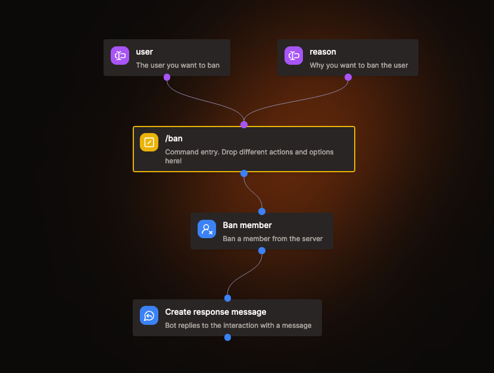

# Custom Command

Custom commands are the primary way for users to interact with your bot. Once you create your first command your users will be able to use them by typing `/` into the Discord chat.

## Command Deployment

Whenever you create a command or update an existing one, Kite will automatically deploy the changes to Discord within 60 seconds.
Some times it's necessary to restart or reload (ctrl+r) your Discord client for the changes to take appear.

Make sure to check your app's logs in Dashboard's overview page to see if there are any errors!

