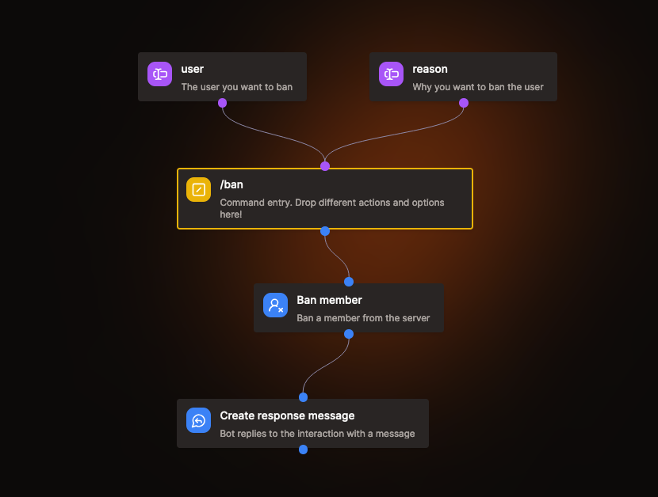

# Custom Command

Custom commands are the primary way for users to interact with your bot. Once you create your first command, users will be able to use it by typing `/` into the Discord chat.

## Command Types

When creating a command you can choose one of three types:

- **Slash Command** – the default, invoked by typing `/` in chat. Has a name, a description, and optional arguments.
- **User Context Menu** – appears when right-clicking a user and opening the **Apps** menu. Has only a name (no description or arguments).
- **Message Context Menu** – appears when right-clicking a message and opening the **Apps** menu. Has only a name (no description or arguments).

User and message context menu commands are managed in the **Context Menus** section of the Studio.

### The Right-Clicked Target

Context menu commands act on whatever the user right-clicked, available in the flow as `command.target`:

- User context menu: `{{command.target.mention}}`, `{{command.target.username}}`, `{{command.target.display_name}}`, `{{command.target.id}}`, `{{command.target.avatar_url}}`.
- Message context menu: `{{command.target.id}}`, `{{command.target.content}}`.

## Sub-Commands

Add spaces (` `) to your command names to create sub-commands, this helps organize related commands into logical groups and improves clarity for users. Sub-commands only apply to slash commands.

## Command Deployment

Whenever you create a command or update an existing one, Kite will automatically deploy the changes to Discord within 60 seconds.
Some times it's necessary to restart or reload (ctrl+r) your Discord client for the changes to appear.

Make sure to check your app's logs in the Dashboard's overview page to see if there are any errors!

