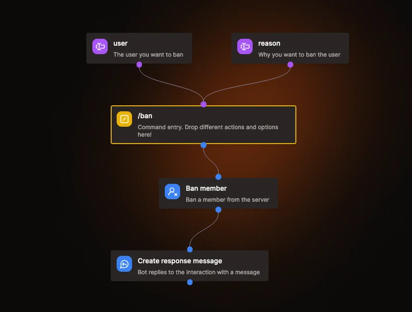

# Custom command

Custom commands are the primary way for users to interact with your bot. Once you create your first command, users will be able to use it by typing `/` into the Discord chat.

## User and Message commands

Pick User command or Message command as the type when you create a command. Members find these in the Apps menu when they right-click a user or message, or long-press one on mobile. Their name can have capital letters and spaces, like `Report message`, and they have no description or arguments.

In the flow, `interaction.command.target_user` is the user the command was used on, and `interaction.command.target_message` is the message. The message's author is `interaction.command.target_message.author`. In a [sub-flow](sub-flows.md) after a button or modal, use `origin.interaction.command.target_user` or `origin.interaction.command.target_message`.

Discord allows up to 15 User commands and 15 Message commands per app. A User command can have the same name as a slash command.

## Sub-commands

Add spaces (` `) to your command names to create sub-commands, this helps organize related commands into logical groups and improves clarity for users.

## Updating commands in Discord

Kite updates your commands in Discord a few seconds after you save them, and the `Commands` page shows when it's done. Sometimes you need to reload your Discord client (`Ctrl+R`) for the changes to appear.

Disabled commands are removed from Discord, so you can keep a command you're still working on disabled until it's ready.

If Discord rejects your commands, the `Commands` page shows why and marks the command that caused it. Discord keeps showing your commands as they were until you fix it. If your commands look out of date in Discord, click on `Sync commands` in the settings of your app.

Make sure to check your app's [logs](../guides/troubleshooting.md#logs) if your command doesn't work!

