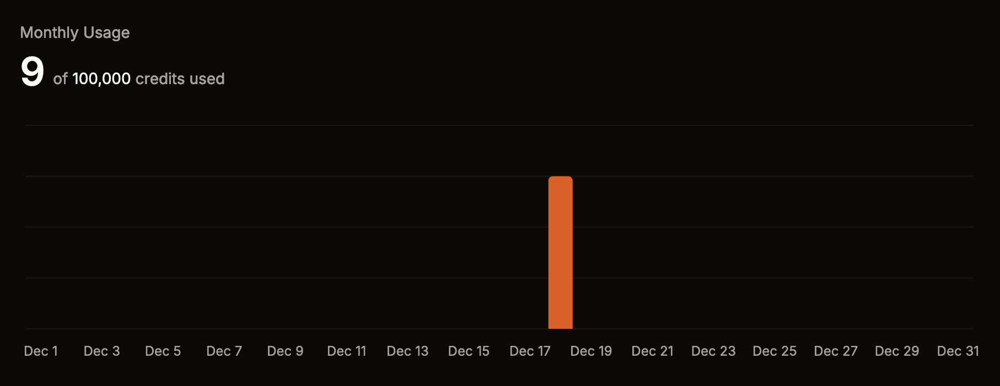

# Credit System

Kite is free to use, but we do have a credit system in place to prevent abuse. Most actions taken by your app in flows will consume credits.

By default, your app has **10,000 credits available per month**. This is usually more than enough for most apps. Subscribe to one of the **Premium** plans to get more credits.

## Cost Breakdown

Most actions in flows will consume **1 credit per execution** with a few exceptions:

- **`Ask AI` block**:
  - `gpt-4.1`: 100 credits per execution
  - `gpt-4.1-mini`: 20 credits per execution
  - `gpt-4.1-nano`: 5 credits per execution
  - `gpt-4o-mini` (default): 5 credits per execution
- **`Search The Web` block**:
  - `gpt-4.1`: 500 credits per execution
  - `gpt-4.1-mini`: 100 credits per execution
  - `gpt-4.1-nano`: 25 credits per execution
  - `gpt-4o-mini` (default): 25 credits per execution
- **`Send API request` block**: 3 credits per execution

Conditions, loops, and other control flow blocks will not consume any credits.

## Tips

Because credits are consumed by every action in your flows, it's important to only run actions when necessary. For example, you should usually not run actions on every message. Instead, you should use conditions to only run actions when certain conditions are met.
