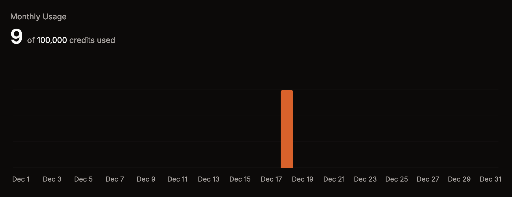

# Credit System

Kite is free to use, but we do have a credit system in place to prevent abuse. Most actions taken by your app in flows will consume [a set amount](#cost-breakdown) of credits.

By default, your app has **10,000 credits available per month**. This is usually more than enough for most apps. You can always subscribe to one of the **Premium** plans to get more credits.

You can track your credit usage on the dashboard in the Monthly Usage section.

## Cost Breakdown

Most actions in flows will consume **1 credit per execution** with a few exceptions:

- **`Ask AI` block**:
  - `gpt-4.1`: 100 credits per execution
  - `gpt-4.1-mini`: 20 credits per execution
  - `gpt-4.1-nano`: 5 credits per execution
  - `gpt-4o-mini` (default): 5 credits per execution
- **`Search The Web` block**:
  - `gpt-4.1`: 500 credits per execution
  - `gpt-4.1-mini`: 100 credits per execution
  - `gpt-4.1-nano`: 25 credits per execution
  - `gpt-4o-mini` (default): 25 credits per execution
- **`Send API request` block**: 3 credits per execution

Control flow blocks, like conditions and loops, will not consume any credits.

## Tips

Since every action in your flows consumes credits, it’s important to run actions only when necessary. For example, you should usually not run actions on every message. Instead, you should use conditions to only run actions when certain conditions are met. 
