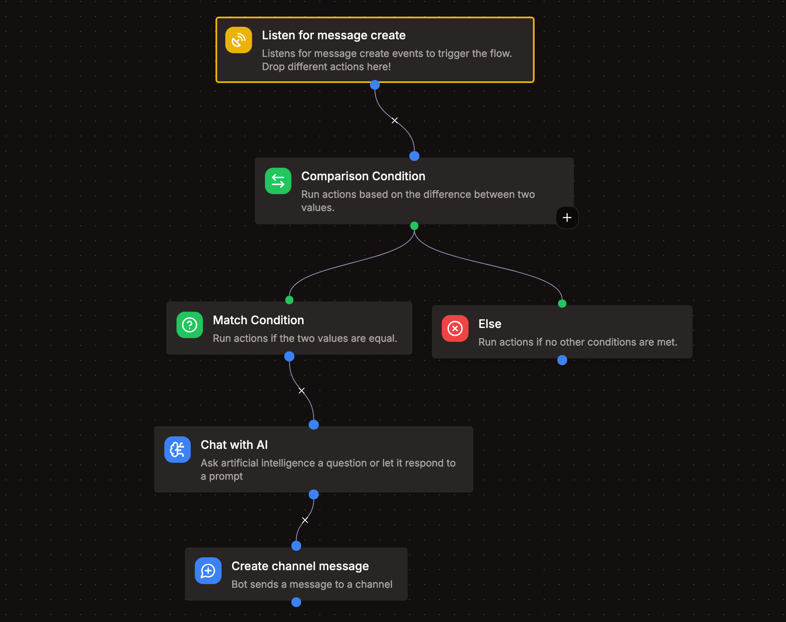

# Event Listener

With Event Listeners you can listen for events inside the Discord servers that your bot is in. Right now, Kite supports the following events:

- Message Create
- Message Update
- Message Delete
- Member Join
- Member Leave

## Restrictions

- By default, your app is limited to 5 event listeners.
- Kite will ignore messages that are sent by a bot.
- Member events are only available when you enable the "Server Members Intent" in the [Discord Developer Portal](https://discord.dev).

## Scheduled Event Listeners

Scheduled event listeners don't wait for something to happen in Discord. They run their flow on a schedule, which you define with a [cron expression](https://crontab.guru). Schedules always use UTC.

| Schedule          | Runs                            |
| ----------------- | ------------------------------- |
| `*/5 * * * *`     | Every five minutes              |
| `0 * * * *`       | At the start of every hour      |
| `0 18 * * 1-5`    | At 18:00 UTC on weekdays        |
| `*/30 * * * * *`  | Every 30 seconds (premium only) |

Add a leading seconds field for schedules that run more than once a minute.

A scheduled run has no user, server or channel. Blocks that act on a server, like banning a member, need a target guild, and messages need a target channel. Response blocks aren't available because there's nothing to respond to. The time the run was scheduled for is available as `{{schedule.time}}` and `{{schedule.unix}}`.

If Kite was down when a run was due, it catches up on the latest missed run if it's at most 5 minutes late. Older runs are skipped. A run is also skipped if the previous run of the same listener is still going.

### Restrictions

- Scheduled event listeners have their own limit, 10 by default.
- By default, a schedule can run at most once every 5 minutes. Premium apps can run schedules every second.
- Every run uses credits like any other flow, so frequent schedules add up quickly. The editor shows an estimate of the credits a schedule uses per month.
