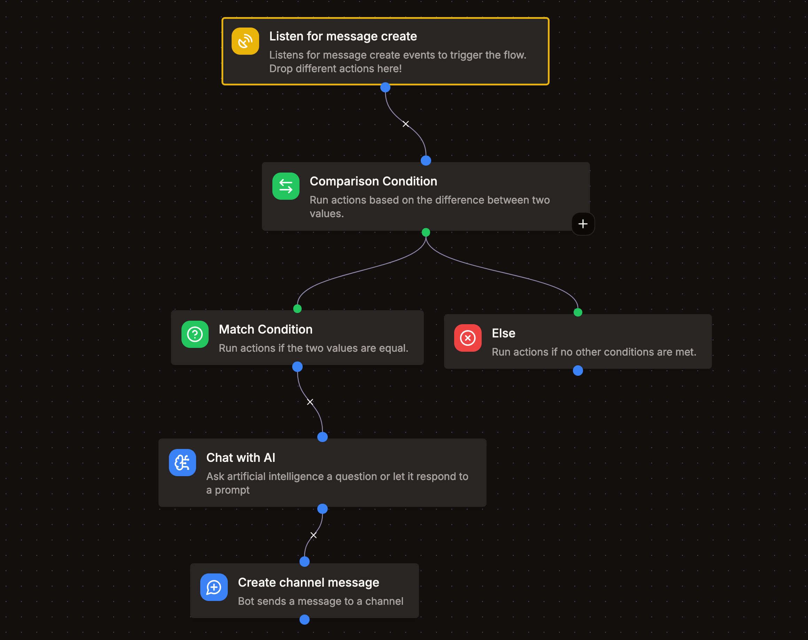

# Event Listener

With Event Listeners you can listen for events inside the Discord servers that your bot is in. They can also run on a [schedule](#scheduled-event-listeners) or when a [webhook](#webhook-event-listeners) is called. Right now, Kite supports the following Discord events:

- Message Create
- Message Update
- Message Delete
- Member Join
- Member Leave
- Reaction Add
- Reaction Remove
- Bot Joined Server
- Bot Left Server

## Restrictions

- By default, your app is limited to 5 event listeners.
- Kite will ignore messages that are sent by a bot.
- Reaction events ignore reactions added or removed by your own app, so a flow that reacts to a message doesn't trigger itself. Reactions by other bots still fire the event.
- Reaction events provide the emoji as `{{emoji}}`, with `{{emoji.id}}`, `{{emoji.name}}` and `{{emoji.mention}}`. `{{emoji.id}}` is empty for unicode emojis.
- Reaction Remove only knows the user's ID, so only `{{user.id}}` and `{{user.mention}}` are available there. Fields like `{{user.username}}` are empty; use a Get User block if you need them.
- Member events are only available when you enable the "Server Members Intent" in the [Discord Developer Portal](https://discord.dev).
- Bot Joined Server provides the server as `{{guild.id}}` and `{{guild.name}}`. Bot Left Server only provides `{{guild.id}}`.



## Scheduled Event Listeners

Scheduled event listeners don't wait for something to happen in Discord. They run their flow on a schedule, which you define with a [cron expression](https://crontab.guru). Schedules always use UTC.

| Schedule       | Runs                       |
| -------------- | -------------------------- |
| `*/5 * * * *`  | Every five minutes         |
| `0 * * * *`    | At the start of every hour |
| `0 18 * * 1-5` | At 18:00 UTC on weekdays   |

A scheduled run has no user, server or channel. Blocks that act on a server, like banning a member, need a target guild, and messages need a target channel. Response blocks aren't available because there's nothing to respond to. The time the run was scheduled for is available as `{{schedule.time}}` and `{{schedule.unix}}`.

If Kite was down when a run was due, it catches up on the latest missed run if it's at most 5 minutes late. Older runs are skipped. A run is also skipped if the previous run of the same listener is still going.

### Restrictions

- Scheduled event listeners have their own limit, 5 by default.
- By default, a schedule can run at most once every 5 minutes. [Premium](./premium.md) apps can run schedules once a minute.
- Every run uses credits like any other flow, so frequent schedules add up quickly. The editor shows an estimate of the credits a schedule uses per month.

## Webhook Event Listeners

Webhook event listeners run their flow when another service sends a request to their webhook URL. Use them to bring things that happen outside of Discord into your server, like a push on GitHub, a new video, a payment or a status alert.

To create one, select **Webhook** as the source of a new event listener. Open the settings of the first block in the flow editor to copy its webhook URL, or use **Copy Webhook URL** in the menu of the event listener. Then enter the URL wherever the other service asks for a webhook URL.

The URL only accepts `POST` requests. Kite answers with status `202` right away and runs the flow in the background, so the sender can't see what the flow did.

You can try it from a terminal:

```shell
curl -X POST "YOUR_WEBHOOK_URL?source=test" \
  -H "Content-Type: application/json" \
  -d '{"repository": {"name": "kite"}}'
```

### Placeholders

| Placeholder                             | Value                                                     |
| --------------------------------------- | --------------------------------------------------------- |
| `{{webhook.body}}`                      | The body of the request as text                           |
| `{{webhook.data.repository.name}}`      | A field of the body parsed as JSON, `kite` in the example |
| `{{webhook.headers['x-github-event']}}` | A header of the request, header names are in lowercase    |
| `{{webhook.query.source}}`              | A query parameter of the URL, `test` in the example       |

Many services send different kinds of events to the same URL and name the kind in a header or in the body. Use a Comparison Condition block on that value to only react to the events you want.

Like a scheduled run, a webhook run has no user, server or channel. Blocks that act on a server need a target guild, and messages need a target channel. Response blocks aren't available because there's nothing to respond to.

### Keeping the URL secret

Anyone who knows the webhook URL can run the flow, and every run uses credits. Treat the URL like a password. If it got out, regenerate it in the settings of the first block. The old URL stops working right away and the new one works within a few seconds. Enter it wherever the old one was used.

The URL isn't part of the flow, so it isn't included when you export, share or duplicate the event listener. A copy gets its own URL.

### Restrictions

- Webhook event listeners have their own limit, which is the same as for Discord event listeners, 5 by default.
- The body of a request can be up to 64 KB, and its headers and query parameters up to 16 KB together.
- All webhook event listeners of an app share a limit of 10 requests per minute. Requests above that are answered with status `429` and don't run the flow.
- Requests are answered with status `404` while the event listener is disabled, and with `503` while your app is offline.
- It can take a few seconds until a new or re-enabled event listener accepts requests.
