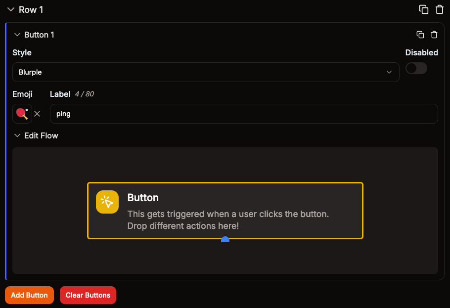

# Message Template

Message Templates are the best way to create highly customized Discord messages. These templates can then be used as a standalone message inside Discord or as a response to commands and events.

Right now message templates support all the Discord embed features, file attachments, and interactive components.

## Interactive Components

You can add interactive components like buttons to your message which your users can interact with.

