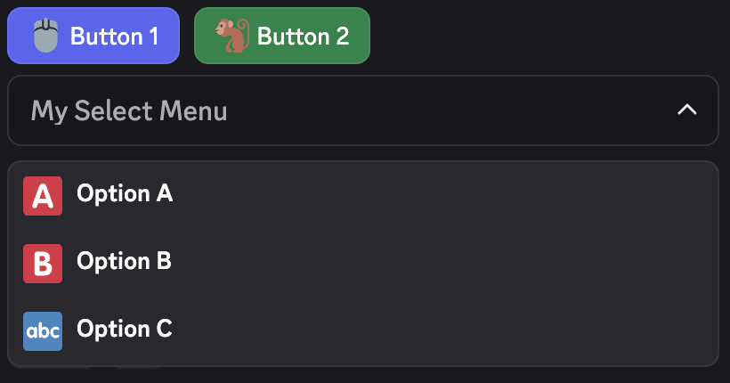
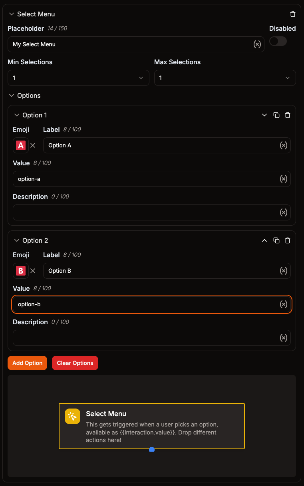
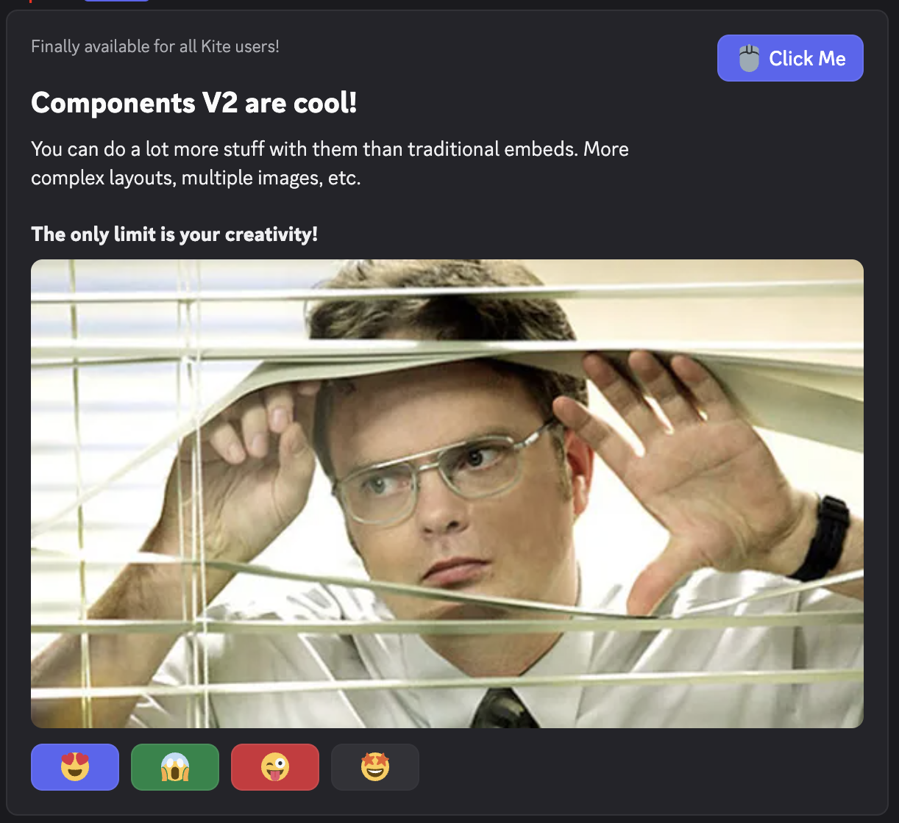

# Message Template

Message Templates are the best way to create highly customized Discord messages. These templates can then be used as a standalone message inside Discord or as a response to commands and events.

Right now message templates support all the Discord embed features, components v2 layouts, file attachments, and interactive components.

## Interactive Components

You can add interactive components like buttons and select menus to your message which your users can interact with.

### Buttons

Each button has its own flow which gets triggered when a user clicks the button. Link buttons open a URL instead and don't have a flow.

### Select Menus

A select menu lets users pick one or more options from a list. Each select menu has one flow which gets triggered when a user picks an option.

Every option needs a unique value. The value is what your flow receives as `{{interaction.value}}`, so you can use a `Comparison Condition` block to run different actions depending on the option that was picked. If the select menu allows picking more than one option, all picked values are available as `{{interaction.values}}`.

## Components V2

Instead of content and embeds you can also build your message out of components v2. Use the switch at the top of the message editor to change between `Embeds` and `Components V2`. The two formats can't be combined, so switching clears the message.

Components v2 give you more control over the layout of your message. The following components are available:

- **Text Display**: Text with markdown formatting, just like the message content
- **Section**: Up to 3 text displays with a thumbnail or button next to them
- **Media Gallery**: Up to 10 images in a grid
- **File**: One of the files attached to the message
- **Separator**: Space between components, with or without a divider line
- **Container**: Groups other components in a box with an optional accent color, similar to an embed
- **Button Row** and **Select Menu**: The same interactive components as above

A message can contain up to 40 components in total, including components that are nested inside of other components.
