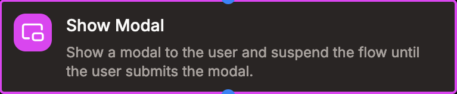
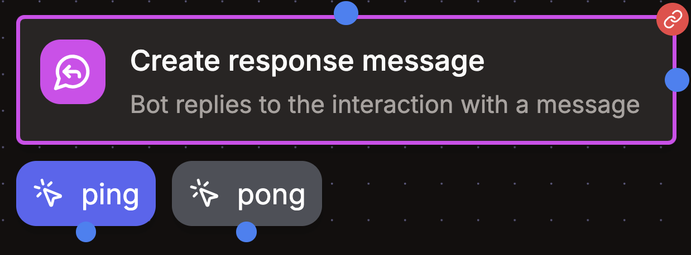

# Sub-flows

Some flow blocks can be used to create sub-flows. These blocks act as a boundary between the main flow and the sub-flow and are highlighted in pink in the flow editor.

Contextual placeholders like the `interaction` placeholders of the main flow aren't available in the sub-flow and are replaced with the `interaction` placeholder of the sub-flow. Node results on the other hand remain available.

## Modals

Modals are a special type of sub-flow. They are used to create interactive experiences. When a modal is opened, the flow execution is suspended and the modal is displayed to the user. The flow execution is resumed when the modal is submitted. You can then access the results of the modal in the main flow using the `interaction.components` placeholder.

Modals can be used to create interactive experiences like forms, quizzes, etc.

## Interactive Messages

When adding buttons to a message, the message becomes interactive. When an interactive message is sent and a user interacts with it, the execution resumes from the corresponding button in the flow. Just attach the blocks you want to each button.
