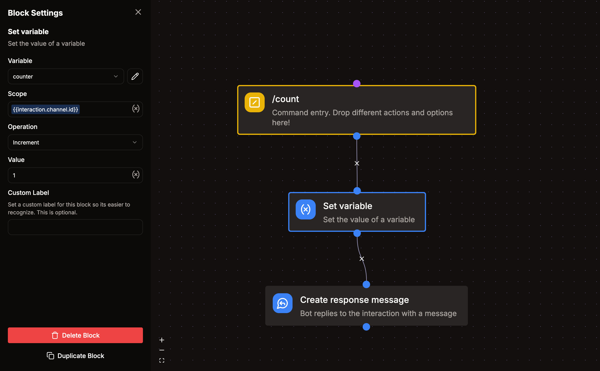

# Shared Variable

With Shared Variables you can store information across commands, events, and message templates.

They can be accessed in commands or event listeners using the "Set variable" or "Get variable" blocks.

Variables can be scoped by a key, which can be anything. Common examples are a user ID, channel ID, or server ID. This allows you to store multiple values in the same variable and access them later.

