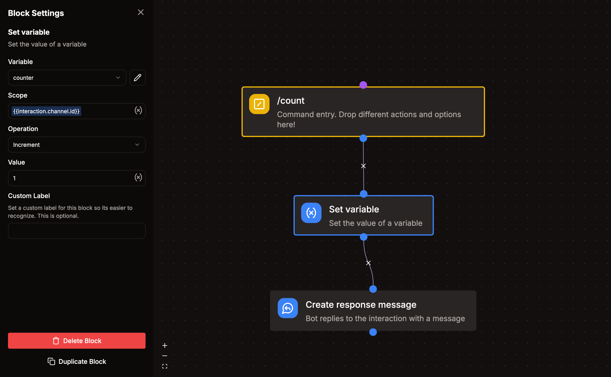

# Stored Variables

With Stored Variables you can store information across commands, events, and message templates.

They can be accessed in commands or event listeners using the "Set variable" or "Get variable" blocks.

Variables can be scoped by a key, which can be anything. Common examples are a user ID, channel ID, or server ID. This allows you to store multiple values in the same variable and access them later.

## Viewing and editing values

Open a variable in the dashboard and scroll to **Stored Values** to see what your flows have stored in it. For a scoped variable there is one row per scope, most recently updated first, and you can search by scope to find a specific user, channel, or server.

From there you can:

- **Add** a value for a new scope, or set the value of a variable that isn't scoped.
- **Edit** a value. Pick the type that matches how your flows use it: Text, Number, True / False, or JSON for lists and objects.
- **Delete** a value. Flows will then find the variable empty for that scope.

Changes apply to flows that run after you save. A flow that changes the same value afterwards overwrites your edit.

Values that hold a Discord object, like a user or message stored from another block's result, and very large values can be viewed and deleted but not edited.
